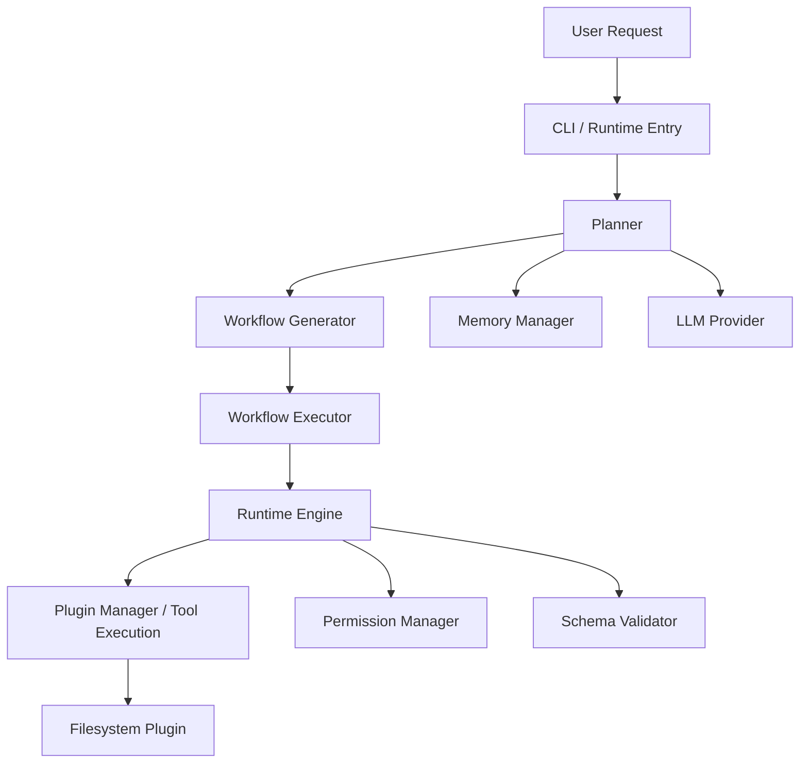

# EdgePilot Project Overview

## 1. Repository Summary

EdgePilot is a TypeScript-based local/edge AI runtime designed to orchestrate agent-style workflows. It is built to connect planner, workflow, runtime, plugin, memory, and LLM provider components in a modular way. The goal is to support lightweight automation and tool execution without requiring cloud infrastructure.

## 2. Purpose and Vision

- Orchestrate AI workflows locally or on edge devices.
- Use provider-agnostic language model integration, with current support for Ollama.
- Keep planning, workflow execution, runtime, memory, and plugins loosely coupled.
- Provide a clean plugin manifest and tool execution model.
- Support commands and demos that show the runtime end-to-end.

## 3. High-Level Architecture

## 4. Top-Level Files

- `README.md` - project documentation and high-level overview.
- `package.json` - dependency and script management.
- `tsconfig.json` - TypeScript compilation settings.
- `llm-config.example.json` - example local LLM provider configuration.
- `PROGRESS.md` - manual progress notes from prior work.

## 5. Key Directories

- `src/` - core source code.
  - `cli.ts` - CLI entrypoint and startup orchestration.
  - `llm/` - provider registration, Ollama integration, service wrappers.
  - `memory/` - memory manager, storage, and context injection.
  - `planner/` - planning, tool capability resolution, workflow generation.
  - `runtime/` - plugins, runtime engine, validation, permissions.
  - `workflow/` - workflow execution, parsing, and step executors.
- `plugins/` - example plugin implementations.
  - `filesystem/` - production-ready local filesystem tools.
  - `ts-example/` - minimal TypeScript example plugin.
- `workflows/` - sample workflow definitions.
- `demo-test-data/` - demonstration markdown sample data.
- `spec/` - JSON schema definitions for plugin manifests and tools.

## 6. Build and Run Commands

From the repository root:

- `npm install` - install dependencies.
- `npm run build` - compile TypeScript into `dist/`.
- `npm run edgepilot -- "<natural language prompt>"` - run CLI with a prompt.
- `npm run start` - run built example.
- `npm run start:e2e-demo` - run the end-to-end demonstration.
- `npm run lint` - run ESLint on `.ts` sources.

## 7. Package Configuration

### `package.json`
- Name: `edgepilot-runtime`
- Version: `0.1.0`
- Private: `true`
- Dependencies:
  - `ajv` - JSON schema validation.
  - `js-yaml` - YAML workflow file parsing.
  - `lodash.get` - nested property access.
  - `uuid` - unique identifiers.
- Dev Dependencies:
  - `@types/node`
  - `@types/uuid`

### `tsconfig.json`
- Target: `ES2020`
- Module: `commonjs`
- Root directory: `src`
- Output directory: `dist`
- Strict mode: `false`
- `esModuleInterop`: `true`
- `lib`: `ES2020`, `DOM`
- Uses Node types through `types: ["node"]`

## 8. CLI and Startup Flow

`src/cli.ts` is the main runtime entrypoint. It performs the following steps:

1. Parses the natural language prompt from command-line arguments.
2. Discovers plugins from the `plugins/` directory using `PluginDiscovery`.
3. Grants plugin permissions via `PermissionManager`.
4. Initializes `RuntimeEngine`, `ProviderManager`, `MemoryManager`, and `PlannerManager`.
5. Registers the `SimpleRulePlanner` strategy.
6. Generates a plan from the prompt.
7. Converts the plan into a workflow if needed.
8. Executes the workflow using `WorkflowExecutor`.
9. Prints execution results and context.

## 9. Planner and Workflow Generation

### Planner

- `src/planner/simple-rule-planner.ts` implements a basic planner.
- It uses keyword matching to map prompt terms to available plugin tools.
- It can inject memory values into the prompt and constraints.
- It generates a `PlanModel` with steps based on available tool capabilities.
- It validates the plan using `PlanValidator`.
- It optionally writes plan metadata into memory scopes.

### Workflow Generator

- `src/planner/workflow-generator.ts` converts a `PlanModel` into a `WorkflowDefinition`.
- Each plan step becomes a workflow step with `pluginId`, `toolId`, and `input`.

### Workflow Compiler

- `src/planner/workflow-compiler.ts` currently performs a no-op compilation step.
- It is a placeholder for future workflow transformations.

## 10. Workflow Execution

### Workflow Structure

`src/workflow/types.ts` defines:
- `WorkflowDefinition`
- `StepDefinition`
- `Condition`
- `RetryPolicy`
- `ExecutionEvent`

### Executor

- `src/workflow/executor.ts` orchestrates execution of workflow steps.
- It supports sequential and `parallel` step groups.
- It maintains execution history and prints summaries.
- The executor uses `TaskStepExecutor` for actual task execution.

### Task Execution

- `src/workflow/step-executors/task-step-executor.ts` does step-level work.
- It evaluates conditional execution through `step.condition`.
- It interpolates step inputs from workflow context.
- It handles retries and optional timeouts.
- It emits execution events for start, completion, skip, and failure.

### Workflow Parser

- `src/workflow/parser.ts` loads workflow definitions from JSON or YAML.
- It validates basic step structure and duplicate IDs.

## 11. Runtime Engine and Plugin System

### Runtime Engine

- `src/runtime/runtime-engine.ts` executes requests against plugins.
- It finds the plugin manifest and tool definition.
- It enforces permissions from `PermissionManager`.
- It validates input and output using `AjvOptionalValidator`.
- It initializes plugins via an optional `initialize()` hook.

### Plugin Manager

- `src/runtime/plugin-manager.ts` registers plugin wrappers.
- It lists plugins and resolves tool objects.

### Plugin Discovery

- `src/runtime/plugin-discovery.ts` scans plugin subdirectories.
- It reads `plugin.json`, optionally validates it against `spec/schemas/plugin.json`.
- It requires the plugin entry file and registers validated wrappers.

### Validator

- `src/runtime/validator.ts` validates against JSON schema when Ajv is available.
- If Ajv is not installed, it falls back to permissive validation.

### Permissions

- `src/runtime/permission-manager.ts` tracks granted permissions by plugin ID.
- The runtime denies tool execution if required permissions are not granted.

### Logger

- `src/runtime/logger.ts` provides a simple console logger interface.

### Runtime Types

- `src/runtime/types.ts` defines plugin and tool contract shapes.
- It includes `ToolDefinition`, `PluginManifest`, `ToolResult`, and `ToolContext`.

## 12. Memory System

### Memory Manager

- `src/memory/memory-manager.ts` is the central memory subsystem.
- It supports scopes: `session`, `conversation`, `workflow`, and `global`.
- It can inject template values using `${key}` placeholders.
- It resolves values from workflow > conversation > session scope.

### In-Memory Storage

- `src/memory/in-memory-storage.ts` implements `StorageInterface`.
- It stores values in-memory with optional TTL.
- It supports snapshots, restore, and cleanup of expired records.

### Memory Types

- `src/memory/types.ts` declares storage interfaces, scopes, and snapshot shapes.

### Planner Memory Integration

- `SimpleRulePlanner` can read memory values when building plans.
- It can write plan metadata and execution context back into memory.

## 13. LLM Provider Support

### Configuration

- `llm-config.example.json` defines provider defaults for Ollama.
- `src/llm/config.ts` loads `llm-config.json` or environment variables.

### Provider Registry

- `src/llm/registry.ts` stores registered LLM providers.
- `src/llm/manager.ts` instantiates providers based on config.

### Provider Interface

- `src/llm/provider.ts` defines `ILLMProvider` and `AbstractLLMProvider`.
- `src/llm/types.ts` defines chat/generation requests, responses, models, and health status.

### Ollama Integration

- `src/llm/ollama-provider.ts` implements Ollama REST API calls.
- Supports health checks, model listing, generation, and streaming.
- Uses `fetch()` with timeout and retry support.

### LLM Service

- `src/llm/llm-service.ts` provides a summarization wrapper.
- It can generate per-file summaries and combine them.
- It falls back to simple text-based summaries if LLM streaming is unavailable.

## 14. Plugins Included

### FileSystem Plugin

Located at `plugins/filesystem/`.

- `plugin.json` declares plugin metadata, capabilities, permissions, and tools.
- `index.js` exports tools and lifecycle hooks.
- Tools include: `fs.list`, `fs.read`, `fs.write`, `fs.append`, `fs.mkdir`, `fs.delete`, `fs.copy`, `fs.move`, `fs.search`, `fs.metadata`.
- It enforces a safe base path and prevents path traversal outside `EDGEPILOT_FS_ROOT`.
- It validates inputs with Ajv.

### TS Example Plugin

Located at `plugins/ts-example/`.

- `plugin.json` declares a minimal echo tool with permission `none`.
- `index.js` exports a plugin wrapper and implements `example.echo`.
- It demonstrates the runtime plugin contract for Node-based modules.

## 15. Example and Demo Files

### `src/examples/run-example.ts`

- Loads the TS example plugin.
- Runs `example.echo` through the `RuntimeEngine`.
- Demonstrates simple runtime execution without workflow orchestration.

### `src/examples/run-e2e-demo.js`

- Demonstrates end-to-end architecture with planner, workflow executor, runtime engine, and filesystem plugin.
- Loads `plugins/filesystem` and grants it filesystem permission.
- Creates a sample workflow for markdown summarization.
- Generates a report in `demo-test-data/SUMMARY.md`.
- Contains fallback behavior when Ollama is unavailable.

### `workflows/markdown-summarization.json`

- Sample workflow definition for discovering markdown files, reading them, and writing summaries.
- Demonstrates templated context injection using `${markdownFiles.0.path}` and `${fileSummaries}`.

## 16. Schema and Plugin Spec

- `spec/schemas/plugin.json` defines the plugin manifest schema.
- It requires `id`, `name`, `version`, and `tools`.
- The runtime discovery process can validate plugin manifests against this schema.

## 17. Current Project Status and Known Limitations

- The project is implemented as a local runtime prototype with a `0.1.0` package version.
- Planner is currently rule-based and keyword-driven; it is not a full LLM planning engine.
- Workflow compilation is a placeholder and does not perform advanced transformations.
- Memory is in-memory only; no persistent external storage is currently implemented.
- The end-to-end demo code is a mix of JavaScript and TypeScript examples.
- `docs/` directory is empty.
- There is no unit test suite yet.
- `README.md` provides a summary but not a complete technical deep dive.

## 18. Detected Git Context

- Repository-level Git email: `amansinghrajput2352@gmail.com`
- Global Git email: `amansinghrajput2352@gmail.com`

## 19. Recommended Next Steps

1. Add unit tests for planner, runtime, workflow executor, and plugin discovery.
2. Implement persistent memory storage adapters.
3. Expand planner strategies beyond keyword matching.
4. Add detailed plugin schema validation and tool contract docs.
5. Add README sections for plugin authoring and configuration.
6. Add a `docs/` site or dedicated architecture documentation.

## 20. Useful File References

- Runtime entry: `src/cli.ts`
- Planner engine: `src/planner/simple-rule-planner.ts`
- Workflow execution: `src/workflow/executor.ts`
- Plugin engine: `src/runtime/runtime-engine.ts`
- Plugin discovery: `src/runtime/plugin-discovery.ts`
- LLM provider: `src/llm/ollama-provider.ts`
- Memory manager: `src/memory/memory-manager.ts`
- Example plugin: `plugins/filesystem/index.js`
- Demo workflow: `workflows/markdown-summarization.json`
- Example runner: `src/examples/run-e2e-demo.js`

---

**This file captures the current implementation, architecture, available components, and runtime context for the EdgePilot repository.**